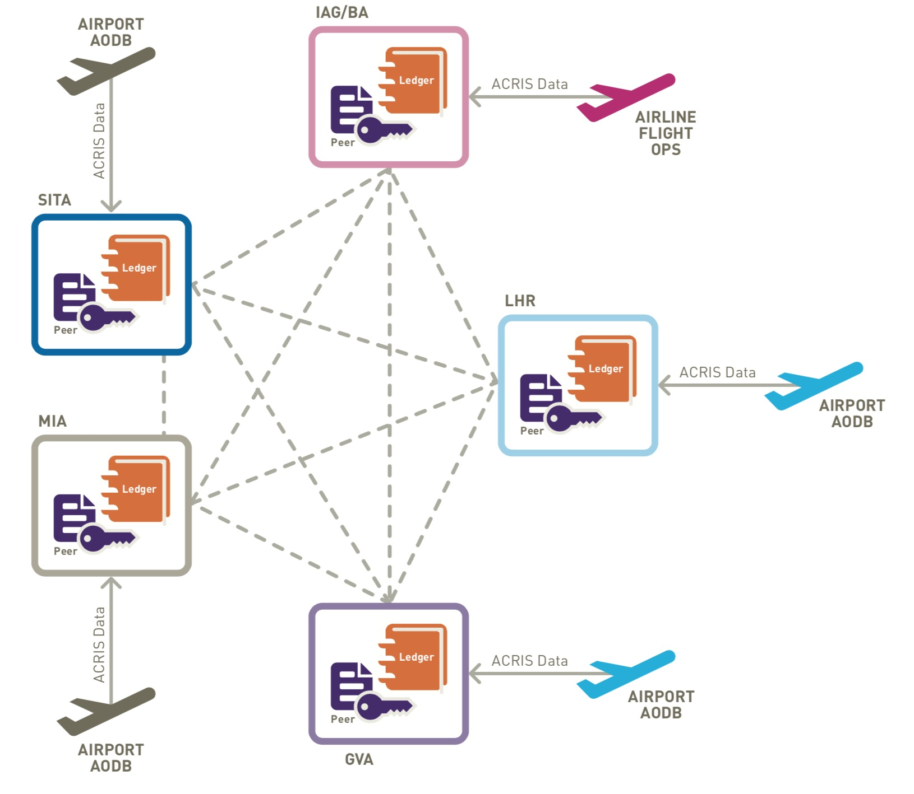
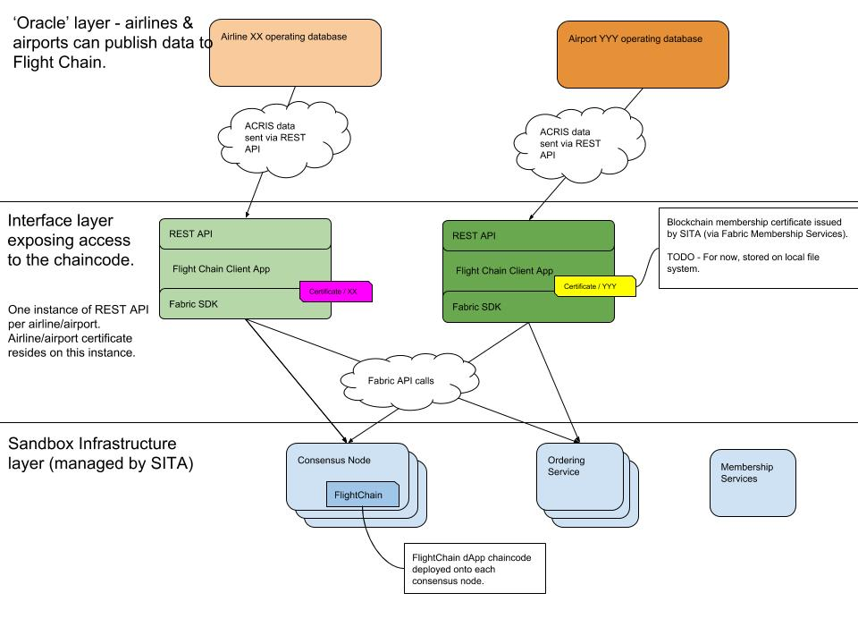

# FlightChain

Flight Chain is one of the reference dApp deployments being put onto the SITA Aviation Blockchain Sandbox. 
It aggregrates flight data from multiple sources and creates a single version of the truth for flight status information 
on a private permissioned blockchain.

This dApp is open to any airline & airport to integrate into. Airlines & airports can publish updates from their AODB
and can query the network to get the complete flight status data (which includes authoritative data from airline, 
origin airport and destination airport).



Figure 1 - illustration of original Flight Chain network. 


## Table of Contents

- [Run on local dev machine](#localdev)
- [Architecture](#architecture)
- [REST API](#rest-apis)
- [ACI ACRIS](#aci-acris)
- [Deployment (TODO)](#deployment)
- [References](#references)

## Running chaincode on local dev environment <a name="localdev"></a>

This repo comes complete with a Fabric network configration. This will work, assuming that you have
already checked out https://github.com/hyperledger/fabric-samples and have gone through the pre-requiset 
steps for fabric-samples.

### Start network & deploy chaincode locally.

The chaincode is in the [chaincode](./chaincode) directory. There is a script [deployChainCode.sh](./chaincode/deployChainCode.sh)
in this network which will setup the local network (the config for this is in [sita-basic-network](sita-basic-network)), and
will then deploy the chaincode onto this network. Go to [chaincode](./chaincode) for more details.


### Testing the API.

The API interface is in [flight-chain-api](flight-chain-api). This exposes a REST interface to create, update & view
flight data. There is a swagger documented API which makes it easy to test the API & chaincode.


## Architecture <a name="architecture"></a>


Figure 2 - high level architecture overview.

This simplified three layer diagram shows:
 
 - The sandbox infrastructure at the bottom. This is the Hyperledger Fabric network (consisting of consensus nodes, 
ordering services and membership services). This is the network manged by SITA. The smart contracts (chain code) gets
deployed onto this, and this network maintains the ledger world state. In future iterations of the blockchain network, 
the consensus nodes will be spread over different airlines/airport data centres.

 - The Flight Chain Fabric Client app is the middle layer. This layer exposes access to the Flight Chain smart contract
 as a set of REST APIs (to query & publish updates). 
 
- The top layer shows airport/airline operating databases which POST updates during the lifecycle of a flight into 
the REST API.   

To comment on this diagram, see the [source architecture document](https://docs.google.com/drawings/d/1Zq-vAdJJv_G257eTWgB1CtkCOL1dma3JcDOeYaw4O4Q/edit)


### REST APIs <a name="rest-apis"></a>


#### 1. Add new flight

This API call shows an example of POSTing a new flight to the ledger. This will return a unique flight key for this flight (`2017-04-05MIAAA1481`).   

```
curl -X POST 'https://flightchain.blockchainsandbox.aero/' -d "
{
  "operatingAirline": {
    "iataCode": "AA",
    "icaoCode": "AAL",
    "name": "American Airlines"
  },
  "aircraftType": {
    "icaoCode": "B757",
    "modelName": "757",
    "registration": "N606AA"
  },
  "flightNumber": {
    "airlineCode": "AA",
    "trackNumber": "1481"
  },
  "departureAirport": "MIA",
  "arrivalAirport": "SDQ",
  "originDate": "2017-04-05",
  "departure": {
    "scheduled": "2017-04-05T12:27:00-04:00",
    "estimated": "2017-04-05T12:27:00-04:00",
    "terminal": "N",
    "gate": "D47"
  },
  "arrival": {
    "scheduled": "2017-04-05T14:38:00-04:00",
    "terminal": "",
    "gate": "",
    "baggageClaim": {
      "carousel": ""
    }
  },
  "flightStatus": "Scheduled"
}
"
```

#### 2. Update an existing flight

This API call shows an example of POSTing an update to the flight (in this case the estimated departure time is updated). Note the use of the flight key value in 
the 

```
curl -X POST 'https://flightchain.blockchainsandbox.aero/2017-04-05MIAAA1481' -d "
{
  "departure": {
    "estimated": "2017-04-05T12:34:00-04:00",
  }
}
"
```


#### 3. Retrieve status on an existing flight

This API call shows an example of querying the realtime status of a flight.

```
curl -X GET 'https://flightchain.blockchainsandbox.aero/2017-04-05MIAAA1481'
```

#### 4. Retrieve update history for a flight

This API call shows an example of retrieving the history of all updates to a flight.

```
curl -X GET 'https://flightchain.blockchainsandbox.aero/2017-04-05MIAAA1481/history'
```

### ACI ACRIS  <a name="aci-acris"></a>
There are many existing data standards for representing flight status data. Flight Chain uses [ACRIS](http://www.aci.aero/About-ACI/Priorities/Airport-IT/ACRIS) 
(a standard defined by [ACI](http://www.aci.aero)). This is a compact & modern data format using JSON with a well defined schema.


### Deployment <a name="deployment"></a>

TBD

### References <a name="references"></a>
SITA Flight Chain - https://www.sita.aero/resources/blog/blockchain-in-air-travel

Aviation Blockchain Sandbox - https://www.developer.aero/Blockchain/Aviation-Blockchain-Sandbox

ACI ACRIS - https://www.aci.aero/About-ACI/Priorities/Airport-IT/ACRIS

Hyperledger Fabric - https://hyperledger-fabric.readthedocs.io/

Coode of Conduct - [CODE-OF-CONDUCT.md](CODE-OF-CONDUCT.md)
