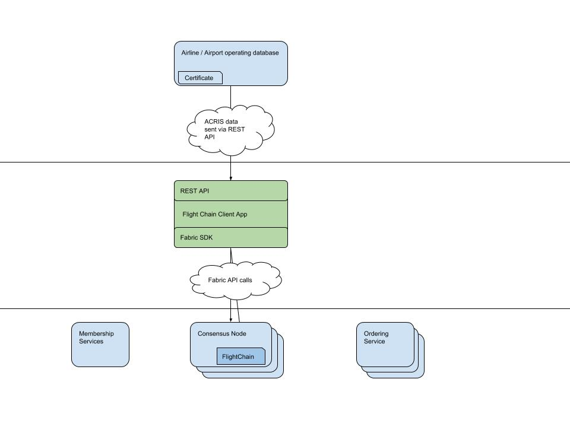

# FlightChain

Flight Chain is one of the reference dApp deployments being put onto the SITA Aviation Blockchain Sandbox. It aggregrates flight data from multiple sources and creates a single version of the truth on a private permissioned blockchain. 

### Architecture

[Source architecture document](https://docs.google.com/drawings/d/1Zq-vAdJJv_G257eTWgB1CtkCOL1dma3JcDOeYaw4O4Q/edit)

### Deployment

### References
SITA Flight Chain - https://www.sita.aero/resources/blog/blockchain-in-air-travel

Aviation Blockchain Sandbox - https://www.developer.aero/Blockchain/Aviation-Blockchain-Sandbox
